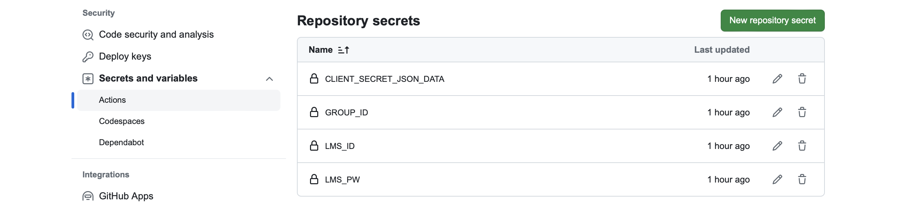

# lms-calendar
전북대학교 LMS에서 원하는 특정 강의 영상이 올라오면 영상 출석 기간을 구글 달력에 자동으로 저장해주는 프로그램


## setting
### API
1. https://riverallzero.tistory.com/76 참고해 Google Calendar API 설정 
2. [test.py](https://github.com/riverallzero/lms-calendar/blob/main/test.py) 실행하며 작동 확인
3. [test.py](https://github.com/riverallzero/lms-calendar/blob/main/test.py) 실행 시 생성된 [token.pickle](https://github.com/riverallzero/lms-calendar/blob/main/token.pickle)을 저장소에 업로드(기존 파일은 삭제)

### secrets
```Settings``` - ```Screts and variable``` - ```Actions``` -```New repository secrets```



4. OAuth Client ID에서 다운받은 json 파일 내용의 값을 복사해 "CLIENT_SECRET_JSON_DATA"에 값 입력
5. LMS에서 원하는 강의의 group_id(자료에서 아무 파일 선택시 url에서 나타남)를 복사한 후 "GROUP_ID"에 값 입력
6. LMS 아이디(LMS_ID)와 비밀번호(LMS_PW)도 값을 입력

### code
7. ```title = '[컴퓨터비전] ' + df['title'][r]``` [main.py](https://github.com/riverallzero/lms-calendar/blob/main/main.py) - line 110: 과목명 변경

### file
8. last_index.txt 파일 삭제
